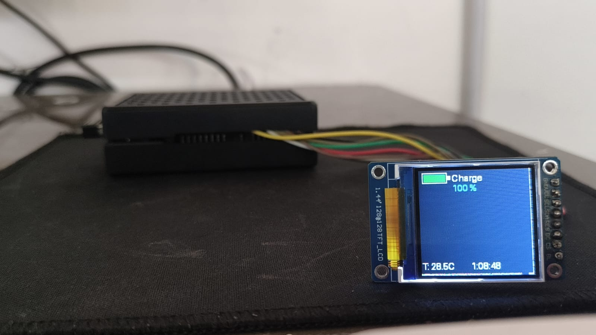
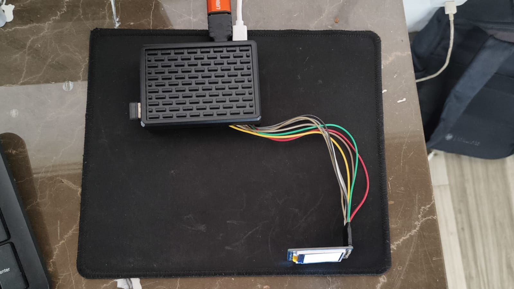

#### **BMS_v1_pi5**:
This zip folder contains all the required program files to run the version 1 part of BMS prototype on Raspberry Pi 5.

#### **Folder structure Description :**
This folder has a main folder " *Battery_prj* "  which has four subfolders inside it,
" *3state_ekf*  "," *codes_to_share* " , " *Priyanshu_Orgnl_Folder* " and  "*Test*" .

1. " *3state_ekf*  " Folder includes four subfolders :
   - *Charge -* This folder has 5 sub-folders, where 4 folders has csv file of different battery _C_ rates for the input, whose path we need to paste on the "codes_to_share/EKF_Simulation.py". And a Result folder where the ekf simulation results would be saved, which can be used by the tft_display program to display it.
   - *Discharge -* similarly like charge folder this folder also has subfolders which has csv files.
   - *HPPC_charge -* (Not Required for v1)
   - *HPPC_discharge -* (Not Required for v1)
   
2._ "_codes_to_share_" Folder includes six files, but currently we only need to work with "EKF_Simulation.py" .

3._ " *Priyanshu_Orgnl_Folder* " has the original files without any manipulation, for the reference folder structure.

4._ "*Test*" folder has two sub folders , but for raspberry pi 5 we will use                "_Pi5_TFT_Testfiles_" 
- for displaying SOC on tft screen we will run this  "_soc_tft_pi5_display1.py_" file using "thevenin-env". 
   

####  **Library Dependencies :**

**Core Libraries:**

●Python 3.10

- thevenin (Battery modeling & prediction)

- scikit-sundae (SUNDIALS interface)

- NumPy, SciPy, Pandas

- Matplotlib (plots & verification)

####### **Display Libraries**

- RPi.GPIO (GPIO control)

- spidev (SPI communication)

- luma.core / luma.lcd

- Pillow (PIL) for text rendering

#### **Hardware Components**
- Raspberry Pi 5 

- Xcluma TFT Display (ST7735, 128×128)

- SD Card, Power Adapter

#### **SOC Estimation Result :**

